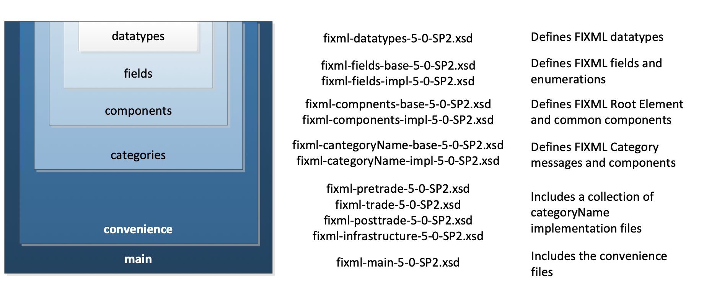
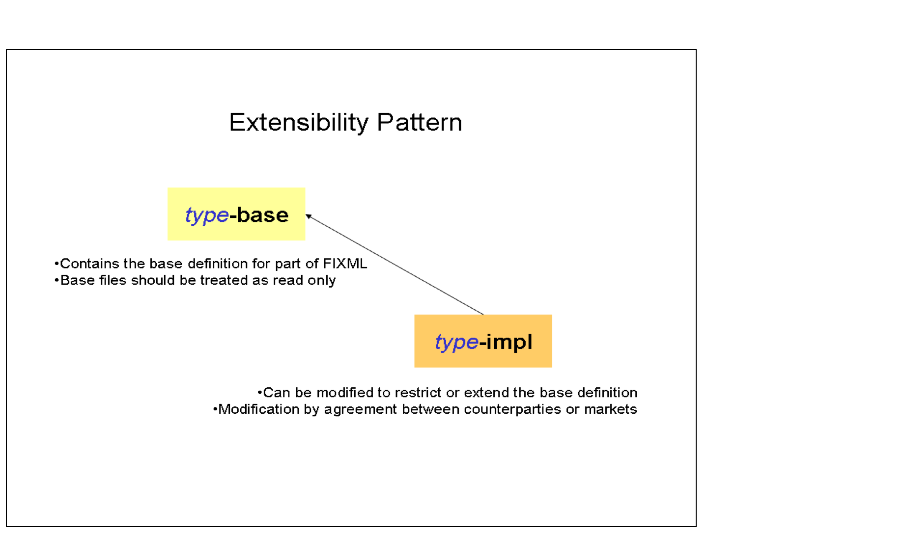
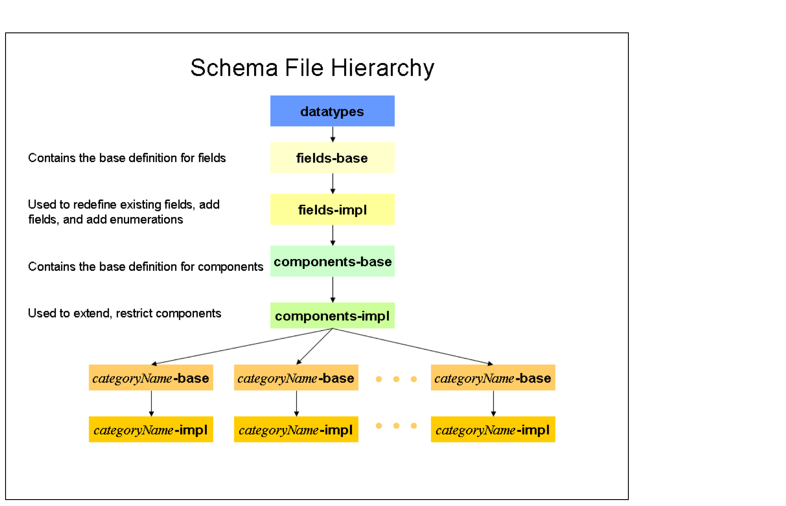
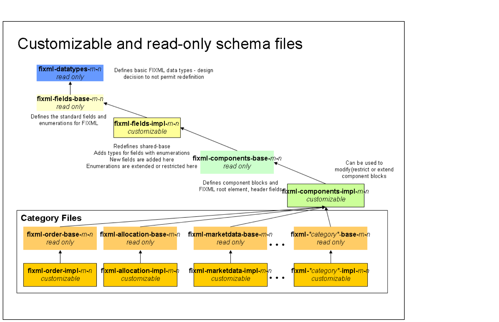
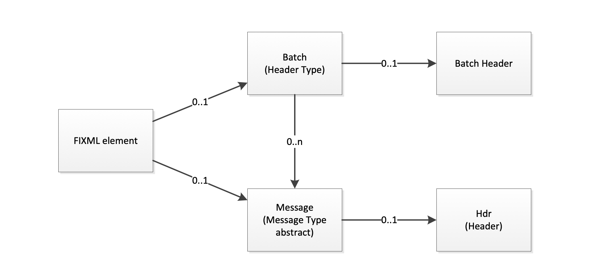
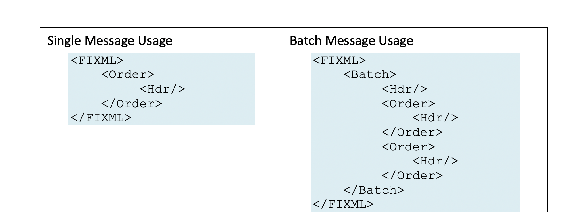

# Introduction

The Financial Information Exchange (FIX) Protocol is a message standard developed to facilitate the electronic exchange of information related to securities transactions. It is intended for use between trading partners wishing to automate communications. FIXML is a technical standard for FIX application messages using XML syntax. This document defines the FIXML 1.1 Technical Standard.

The Technical Specification is split into the following sections:

1. [Introduction](#introduction)
2. [FIXML Schema Design Rules](#fixml-schema-design-rules)
3. [FIXML Schema Implementation](#fixml-schema-implementation)
4. [FIXML Root Element](#fixml-root-element)
5. [FIXML Datatypes](#fixml-datatypes)
6. [FIXML Fields](#fixml-fields)
7. [FIXML Components](#fixml-components)
8. [FIXML Categories](#fixml-categories)
9. [FIXML Convenience Files](#fixml-convenience)
10. [FIXML Customization](#fixml-customization)
11. [FIXML Schema File Summary](#fixml-schema-file-summary)

## Background

The FPL FIXML working group began investigating the XML format in 1998 and published a white paper supporting an evolutionary approach to support the FIX Protocol using an XML format. The working group released an initial version of the FIXML DTDs on January 15th, 1999. There are DTDs based on FIX Protocol versions 4.1, 4.2 and 4.3. A FIXML Schema was established with the release of FIX 4.4. The working group then focused on optimizing and enhancing the use of XML technologies. The FIXML 1.1 Technical Standard is the result of these enhancements to optimizations for FIX messaging and has been available as part of the standard release process since FIX 5.0 SP2 (April 2009).

## FIXML Features

-   FIXML uses the FIX data dictionary and business logic from the FIX Repository.

-   FIXML is the XML representation and vocabulary for FIX application messages.

-   FIXML includes FIX application messages and does not include a session layer.

-   FIXML can be encapsulated within the FIX Session Protocol or within another protocol like, MQ Series, TIBCO, SOAP, etc.

## Specification terms

These key words in this document are to be interpreted as described [in Internet Engineering Task Force RFC 2119](http://www.apps.ietf.org/rfc/rfc2119.html). These terms indicate an absolute requirement for implementations of the standard: "**must**", or "**required**".

This term indicates an absolute prohibition: "**must not**".

These terms indicate that a feature is allowed by the standard but not required: "**may**", "**optional**". An implementation that does not provide an optional feature must be prepared to interoperate with one that does.

These terms give guidance, recommendation or best practices: "**should**" or "**recommended**". A recommended choice among alternatives is described as "**preferred**".

These terms give guidance that a practice is not recommended: "**should not**" or "**not recommended**".

## Document format

In this document, examples of FIXML will appear with the FIXML root element enclosing elements, attributes and attribute values.

```xml
<FIXML><element attribute="attributeValue"></FIXML>
```

## References

### Related FIX Standards

For FIX semantics, see the FIX message specification [FIX Version 5.0 Service Pack 2](https://www.fixtrading.org/standards/fix-5-0-sp-2/).

Specific Extension Packs affecting the FIXML standard include:

-   FIXML Inline Component Extension as part of EP105 -- Parties Reference Data Extensions
-   EP145 -- GFIC LegSecurityXML Extension
-   EP161 -- CFTC Parts 43-45 Phase 1 (new FIXML datatypes)
-   EP178 -- Batch Header Extension
-   EP192 -- CME Regulatory TradeReporting Extensions (deprecation of Online Implicit Block Repeating)

### Other standards

XML 1.1 schema standards are located here: [W3C XML Schema](http://www.w3.org/XML/Schema.html#dev).

# FIXML Schema Design Rules

The FIXML schema may be used to validate FIXML messages. The FIXML schema is generated from the FPL Repository. The FIXML schema may be extended to include enhancements and restrictions of the FIX application messaging standard.

The following design rules support the design objectives for the FIXML Schema and the FIXML instance documents.

1.  FIXML naming
    1.  Use meaningful abbreviations for element and attribute names wherever possible. Use standard abbreviations for common words (e.g., Price = Px, Currency = Ccy, etc.).
    2.  Field name prefixes that were used in FIX tag=value format for uniqueness shall be removed -- thus creating a contextual abbreviation.
2.  The FIXML root element may include version identifiers (see section on version attributes below).
3.  The FIXML root element will include a single FIXML message or a batch of FIXML messages (see section on batching FIXML messages below).
4.  FIX messages are implemented as an XML element.
    1.  The FIXML element name is the abbreviated name of the message.
    2.  The FIXML element is implemented with a complexType unique for each message.
        1. The message complexType name is a concatenation of the message name and the string `_message_t`.
        2. The message complex type is extended by the complexType Abstract`_message_t`.
        3. The message complexType includes a group with a sequence consisting of the message elements (see component instances implemented as elements below).
        4. The message complexType includes the attributeGroup for the message (see field instances implemented as attributes below).
    3.  FIXML elements are not generated for messages that are coded in the repository with NotReqXML=1. These messages are generally not application level messages and include session level messages such as Logon(35=A), Logout(35=5), etc.).
5.  FIX field instances within a message or a component are implemented as an attribute within an attribute group for the message or component.
    1.  The FIXML attribute name is the abbreviated name of the field or a separate abbreviated name within a category as coded in the FIX repository.
    2.  The FIXML attribute Type is implemented as the field simpleType (see FIX fields implemented as a simpleType below).
    3.  The FIXML attribute Use is set to required or optional based on whether or not the field instance is required within the message or component.
    4.  The FIXML attributeGroup name is based on concatenation of the message or component name and the string "Attributes" (e.g. AllocationInstructionAttributes for the AllocationInstruction message)
    5.  The FIXML attribute is not generated for those fields coded as NotReqXML="1". These fields are generally those that are needed in the Tag=value syntax and not needed in FIXML (e.g. fields that are coded with the NumInGroup data type).
6.  FIX component instances within a message or another component are implemented as an XML element in a sequence of elements for the message or parent component.
    1.  The FIXML component instance element name is the abbreviated name of the FIX component.
    2.  The FIXML component instance element type is implemented as the component complexType (see FIXML components implemented as a complexType below).
    3.  The FIXML component instance element minOccurs="1" for components coded as required and minOccurs="0" for components coded as not required in the FIX repository.
    4.  The FIXML component instance element maxOccurs="1" for components with the type of Block (or ImplicitBlock) in the FIX repository and maxOccurs="unbounded" for components with the type BlockRepeating (or ImplicitBlockRepeating) in the FIX repository.
    5.  A FIXML component instance element that is coded as inlined in the FIX repository will not be generated. Attributes of this component will be appended to the attributes of the parent component or message. Elements of this inlined component will be appended to the element sequence for the parent component or message.
    6.  The FIXML elements for components are not generated for components that are coded in the repository with NotReqXML=1. The StandardTrailer component is an example of a component that is not generated in FIXML.
7.  FIX components are implemented as a complexType.
    1.  The FIXML complexType name is a concatenation of the FIX component name and the string `_Block_t`.
    2.  The FIXML component complexType includes a group with a sequence consisting of the component elements. The name of the group is a concatenation of the component name and the string "Elements".
    3.  The FIXML component complexType includes an attributeGroup. The attributeGroup name is a concatenation of the component name with the string ""Attributes".
8.  FIX fields are implemented as a simpleType.
    1.  The FIXML field simpleType name is a concatenation of the FIX field name and the string `_t` (e.g. `Account_t`).
    2.  The FIXML field simpleType is restricted by the FIX field data type or in the case of an enumerated field, by the FIXML field enumeration simpleType (see FIX field enumerations implemented as a simpleType below).
    3.  The FIXML field simpleType includes the FIX field description as documentation.
    4.  The FIXML field simpleType includes the FIX field name, component type tag, data type and abbreviated name as application information to cross reference.
9.  FIX field enumerations are implemented as a simpleType.
    1.  The FIXML field enumeration simpleType name is a concatenation of the field name and the string `_enum_t` (e.g. `AdvSide_enum_t`).
    2.  The FIXML field enumeration simpleType is restricted by the FIX field data type.
    3.  The FIXML field enumeration simpleType includes the enumeration values for the FIX field.
    4.  The FIXML field enumeration simpleType includes the enumeration descriptions for each FIX field enumeration value.
10. FIX Categories are used to organize FIXML schema files.
    1.  The FIXML file name
    2.  Categories coded with NotReqXML=1 are not used in FIXML schema generation (e.g. Session category).
    3.  FIX Category Sections are used to generate the pre-trade, trade, post-trade and infrastructure FIXML schema files.
11. FIX datatypes are mapped to the closest XML Schema datatype whenever possible, thus making FIXML more compatible with standard XML toolsets.
12. The complex type Abstrace`_message_t` includes the attributes and elements of the StandardHeader component.

# FIXML Schema Implementation

Organization of files is driven largely by the requirement to support customization of the FIXML Schema. The basic organization of the schema has the datatypes used by the fields maintained in a separate file. FIX fields are defined in the shared file. Components and the FIXML root element are defined in the component files. FIXML messages are defined within separate category files. Convenience files include the category files and the main file includes the convenience files. The figure below illustrates the relationship of these file types.



##  Extensibility Design Pattern

An extensibility design pattern is implemented in the FIXML schema that defines how the FIXML definition is partitioned and organized within separate schema files in order to provide a uniform method to support customization.

The figure below illustrates the relationship between the base and implementation files and the general extensibility design pattern.



Each level of schema file (with the exception of datatypes and convenience files) includes a base definition file that defines the standard (default) FIXML language. Each level also includes an implementation (impl) file that references the base definition.

The figure below illustrates how the design pattern is applied to the various layers of schema files.



In general, base schema files are intended to be read only and include the FIX standard and implementation files are used to support customization of the base file content.

The figure below illustrates the read only and customizable files within the FIXML schema hierarchy.



## FIXML Schema file naming conventions

As described above, the FIXML schema includes several files. The file naming convention is as follows:

fixml-*Type*-{base\|impl}-*Version*.xsd

*Type* is one of:

- <*category*> - where category is in general one of the FIX message categories (e.g. "multilegorders" for category "MultilegOrders"), exceptions as follows:
    - "newsevents" for category "EventCommunication"
    - "indications" for category "Indication"
    - "order" for category "SingleGeneralOrderHandling"
    - "listorders" for category "ProgramTrading"
    - omission of "date" or "referencedata", e.g. "partiesreference" for category "PartiesReferenceData"
    - omission of "management", e.g. "collateral" for category "CollateralManagement"
- "components"
- "datatypes"
- "fields"
- "main"
- "metadata"

*Version* is the FIX application level version (e.g. "5-0-SP2")

**Examples**
    <!-- formats as source code due to 4 spaces of indentation, next line must be empty -->

    fixml-components-base-5-0-SP2.xml
    fixml-components-impl-5-0-SP2.xml
    fixml-datatypes-5-0-SP2.xml
    fixml-main-5-0-SP2.xml
    fixml-metadata-5-0-SP2.xml
    fixml-order-base-5-0-SP2.xml
    fixml-order-impl-5-0-SP2.xml

The type of the schema file is identified in the second component of the file name. The datatypes file contains the basic datatypes used within FIXML. The shared files contain the definitions for FIX fields. The components file contains definitions for FIXML components, additional components identified while defining the FIXML schema, and the outer elements for FIX.

Several FIXML schema files are either a base file or an implementation (impl). Base files define the standard FIXML language. Impl files are used to extend or restrict the base FIXML language.

Refer to the FIXML Schema File Summary section for a complete list of schema files used in FIXML.

# FIXML Root Element

The FIXML root element is used to support versioning requirements and the ability to batch messages.

## FIXML Versioning Attributes

The FIXML root element <FIXML> includes several optional attributes that can be used to identify the application and FIXML version details. The FIXML root element is defined in the `fixml-components-base-5-0-SP2.xsd` schema file. The table below illustrates the root level version attributes.

Table: FIXML Versioning Attributes

  Attribute      Description                                                            Field(Tag)/datatype      Example
  -------------- ---------------------------------------------------------------------- ------------------------ -----------------------------
  v              FIX Version                                                            ApplVerID(1128)          FIX.5.0SP2
  r              FIX Version release date (Deprecated)                                  `xs:string`              []{custom-style="FIXCompact"}
  xv             FIX Extension Pack number                                              ApplExtID(1156)          192
  cv             Custom functionality, support of which requires bilateral agreement.   CstmApplVerID(1129)      []{custom-style="FIXCompact"}
  xr             FIX Extension release date (Deprecated)                                `xs:string`              []{custom-style="FIXCompact"}
  s              FIXML Schema Release                                                   `xs:date` (Fixed)        2014-05-07
  -------------- ---------------------------------------------------------------------- ------------------------ -----------------------------

**Example:**

```xml
<FIXML v="FIX.5.0SP2" xv="192" s="2014-05-07"> ... </FIXML>
```

## Batching FIXML messages

The FIXML root element <FIXML> supports the ability to include either a single or a batch of FIXML application messages. Batch capability is provided to support groups of messages, such as post trade confirms or position reports at the end of a trading session.

### Batching Structure

The entity relationship diagram below illustrates the message batching elements and design.



The figure below illustrates the high level FIXML structure for a single FIX message compared to a batch of FIX messages. For greater detail, refer to the detailed examples included later in this document.



### Batch Attributes

The capability to indicate several optional batch attributes was added in FIX 5.0 SP2 EP128. These additional batch attributes include:

-   BatchID(50000) `@ID` (String)

-   BatchProcessMode(50001) `@ProcMode` (int)

-   BatchTotalMessages(50002) `@TotMsg` (int)

`@ID` is a unique identifier for a batch of messages.

`@ProcMode` indicates the processing mode for a batch of messages:

Valid values include:

0 -- Incremental update (default if not specified)

1 -- Snapshot (The batch of messages is a complete set)

`@TotMsg` indicates the total number of messages in the batch.

## FIXML Single Message Example

This example is a FIX NewOrderSingle(35=D) message sent individually in FIXML.

```xml
<FIXML v="FIX.5.0SP2" xv="192" s="2014-05-07">
    <Order ID="123456" Side="2" TxnTm="2001-09-11T09:30:47-05:00" Typ="2" Px="93.25" Acct="26522154">
        <Instrmt Sym="IBM" ID="459200101" Src="1"/>
        <OrdQty Qty="1000"/>
    </Order>
</FIXML>
```

## FIXML Batch Message Example

This example shows a batch of position reports.

Note that the header is provided for the entire batch of messages. The batch attribute \@TotMsg is an optional batch attribute indicating the number of messages included in the batch.

```xml
<FIXML v="FIX.5.0SP2" xv="192" s="2014-05-07">
    <Batch ID="11212" TotMsg="3">
        <Hdr Snt="2001-12-17T09:30:47-05:00" SID="OCC" TID="Firm"/>
        <PosRpt RptID="541386431" Rslt="0" BizDt="2003-09-10" Acct="1" AcctTyp="1" SetPx="0.00" SetPxTyp="1" PriSetPx="0.00" ReqTyp="0" Ccy="USD">
            <Pty ID="OCC" R="21"/>
            <Pty ID="99999" R="4"/>
            <Pty ID="C" R="38">
            <Sub ID="ZZZ" Typ="2"/>
            </Pty>
            <Instrmt Sym="AOL" ID="KW" Src="J" CFI="OCASPS" MMY="20031122" MatDt="2003-11-22" StrkPx="47.50" StrkCcy="USD" Mult="100"/>
            <Qty Typ="SOD" Long="35" Short="0"/>
            <Qty Typ="FIN" Long="20" Short="10"/>
            <Qty Typ="IAS" Long="10"/>
            <Amt Typ="FMTM" Amt="0.00"/>
        </PosRpt>
        <PosRpt RptID="541386536" Rslt="0" BizDt="2003-09-10" Acct="1" AcctTyp="1" SetPx="0.00" SetPxTyp="1" PriSetPx="0.00" ReqTyp="0" Ccy="USD">
            <Pty ID="OCC" R="21"/>
            <Pty ID="99999" R="4"/>
            <Pty ID="C" R="38">
            <Sub ID="ZZZ" Typ="2"/>
            </Pty>
            <Instrmt Sym="AOL" ID="KW" Src="J" CFI="OCASPS" MMY="20031122" MatDt="2003-11-22" StrkPx="47.50" StrkCcy="USD" Mult="100"/>
            <Qty Typ="SOD" Long="35" Short="0"/>
            <Qty Typ="FIN" Long="20" Short="10"/>
            <Qty Typ="IAS" Long="10"/>
            <Amt Typ="FMTM" Amt="0.00"/>
        </PosRpt>
        <PosRpt RptID="541386678" Rslt="0" BizDt="2003-09-10" Acct="1" AcctTyp="1" SetPx="0.00" SetPxTyp="1" PriSetPx="0.00" ReqTyp="0" Ccy="USD">
            <Pty ID="OCC" R="21"/>
            <Pty ID="99999" R="4"/>
            <Pty ID="C" R="38">
            <Sub ID="ZZZ" Typ="2"/>
            </Pty>
            <Instrmt Sym="AOL" ID="KW" Src="J" CFI="OCASPS" MMY="20031122" MatDt="2003-11-22" StrkPx="47.50" StrkCcy="USD" Mult="100"/>
            <Qty Typ="SOD" Long="35" Short="0"/>
            <Qty Typ="FIN" Long="20" Short="10"/>
            <Qty Typ="IAS" Long="10"/>
            <Amt Typ="FMTM" Amt="0.00"/>
        </PosRpt>
    </Batch>
</FIXML>
```

# FIXML Datatypes

The fixml-datatypes-5-0-SP2.xsd schema file contains definitions for the FIXML datatypes. Many of the XML Schema standards are based upon ISO standard datatypes. This means that the FIX representation of UTCTimestamp is different from the FIXML representation. The requirement for conversion between FIX tag=value datatypes and XML is left to implementers.

FIX data types are mapped to the closest XML schema data type whenever possible. The table below lists the FIX data types, the base data type and the FIXML implementation.

Table: FIXML Datatypes

  Type                  Base Type                     FIXML Implementation                                                                                                                                                  Example
  --------------------- ----------------------------- --------------------------------------------------------------------------------------------------------------------------------------------------------------------- ----------------------------------------------------------------------
  int                   []{custom-style="FIXCompact"} Use builtin type: xs:integer                                                                                                                                          []{custom-style="FIXCompact"}                  
  Length                int                           `<xs:simpleType name="Length"> <xs:restriction base="xs:nonNegativeInteger"> </xs:restriction> </xs:simpleType>`                                                      []{custom-style="FIXCompact"}        
  TagNum                int                           `<xs:simpleType name="TagNum"> <xs:restriction base="xs:nonNegativeInteger"> </xs:restriction> </xs:simpleType>`                                                      []{custom-style="FIXCompact"}        
  SeqNum                int                           `<xs:simpleType name="SeqNum"> <xs:restriction base="xs:positiveInteger"> </xs:restriction> </xs:simpleType>`                                                         []{custom-style="FIXCompact"}        
  NumInGroup            int                           NOT REQUIRED IN FIXML                                                                                                                                                 []{custom-style="FIXCompact"}                  
  DayOfMonth            int                           NOT REQUIRED IN FIXML                                                                                                                                                 []{custom-style="FIXCompact"}                  
  float                 []{custom-style="FIXCompact"} Use builtin type: `xs:decimal`                                                                                                                                        []{custom-style="FIXCompact"}                    
  Qty                   float                         `<xs:simpleType name="Qty"> <xs:restriction base="xs:decimal"> </xs:restriction> </xs:simpleType>`                                                                    []{custom-style="FIXCompact"}        
  Price                 float                         `<xs:simpleType name="Price"> <xs:restriction base="xs:decimal"> </xs:restriction> </xs:simpleType>`                                                                  `Strk="47.50"`
  PriceOffset           float                         `<xs:simpleType name="PriceOffset"> <xs:restriction base="xs:decimal"> </xs:restriction> </xs:simpleType>`                                                            []{custom-style="FIXCompact"}       
  Amt                   float                         `<xs:simpleType name="Amt"> <xs:restriction base="xs:decimal"> </xs:restriction> </xs:simpleType>`                                                                    `Amt="6847.00"`
  Percentage            float                         `<xs:simpleType name="Percentage"> <xs:restriction base="xs:decimal"> </xs:restriction> </xs:simpleType>`                                                             []{custom-style="FIXCompact"}        
  char                  []{custom-style="FIXCompact"} `<xs:simpleType name="xs:string"> <xs:restriction base=""> <xs:pattern value=".{1}"/> </xs:restriction> </xs:simpleType>`                                             []{custom-style="FIXCompact"}    
  Boolean               char                          `<xs:simpleType name="Boolean"> <xs:restriction base="xs:string"> <xs:pattern value="[YN]{1}"/> </xs:restriction> </xs:simpleType>`                                   []{custom-style="FIXCompact"}  
  String                []{custom-style="FIXCompact"} Use builtin type: `xs:string`                                                                                                                                         []{custom-style="FIXCompact"}                    
  MultipleCharValue     String                        `<xs:simpleType name="MultipleCharValue"> <xs:restriction base="xs:string"> <xs:pattern value="[A-Za-z0-9](\s[A-Za-z0-9])*"/> </xs:restriction> </xs:simpleType>`     []{custom-style="FIXCompact"}
  MultipleStringValue   String                        `<xs:simpleType name="MultipleStringValue"> <xs:restriction base="xs:string"> <xs:pattern value=".+(\s.+)*"/> </xs:restriction> </xs:simpleType>`                     []{custom-style="FIXCompact"}  
  Country               String                        `<xs:simpleType name="Country"> <xs:restriction base="xs:string"> <xs:pattern value=".{2}"/> </xs:restriction> </xs:simpleType>`                                      []{custom-style="FIXCompact"}    
  Currency              String                        `<xs:simpleType name="Currency"> <xs:restriction base="xs:string"> <xs:pattern value=".{3}"/> </xs:restriction> </xs:simpleType>`                                     `StrkCcy="USD"`
  Exchange              String                        `<xs:simpleType name="Exchange"> <xs:restriction base="xs:string"> <xs:pattern value=".*"/> </xs:restriction> </xs:simpleType>`                                       []{custom-style="FIXCompact"}   
  MonthYear             String                        `<xs:simpleType name="MonthYear"> <xs:restriction base="xs:string"> <xs:pattern value="\d{4}(0|1)\d([0-3wW]\d)?"/> </xs:restriction> </xs:simpleType>`                `MonthYear="200303"`, `MonthYear="20030320"`, `MonthYear="200303w2"`
  UTCTimestamp          String                        `<xs:simpleType name="UTCTimestamp"> <xs:restriction base="xs:dateTime"> </xs:restriction> </xs:simpleType>`                                                          `TransactTm="2001-12-17T09:30:47-05:00"`
  UTCTimeOnly           String                        `<xs:simpleType name="UTCTimeOnly"> <xs:restriction base="xs:time"> </xs:restriction> </xs:simpleType>`                                                               `MDEntryTime="13:20:00.000-05:00"`
  UTCDateOnly           String                        `<xs:simpleType name="UTCDateOnly"> <xs:restriction base="xs:date"> </xs:restriction> </xs:simpleType>`                                                               `MDEntryDate="2003-09-10"`
  LocalMktDate          String                        `<xs:simpleType name="LocalMktDate"> <xs:restriction base="xs:date"> </xs:restriction> </xs:simpleType>`                                                              `BizDate="2003-09-10"`
  LocalMktTime          String                        Use builtin type: `xs:time`                                                                                                                                           `ValTm="07:00:00"`
  TZTimeOnly            String                        `<xs:simpleType name="TZTimeOnly"> <xs:restriction base="xs:time"> </xs:restriction> </xs:simpleType>`                                                                []{custom-style="FIXCompact"}        
  TZTimestamp           String                        `<xs:simpleType name="TZTimestamp"> <xs:restriction base="xs:dateTime"> </xs:restriction> </xs:simpleType>`                                                           []{custom-style="FIXCompact"}        
  data                  String                        `<xs:simpleType name="data"> <xs:restriction base="xs:string"> </xs:restriction> </xs:simpleType>`                                                                    []{custom-style="FIXCompact"}        
  XMLData               String                        `<xs:simpleType name="XMLData"> <xs:restriction base="xs:string"> </xs:restriction> </xs:simpleType>`                                                                 []{custom-style="FIXCompact"}        
  Language              String                        `<xs:simpleType name="Language"> <xs:restriction base="xs:language"> </xs:restriction> </xs:simpleType>`                                                              `en` (English), `es` (spanish), etc.
  Pattern               []{custom-style="FIXCompact"} NOT REQUIRED IN FIXML                                                                                                                                                 []{custom-style="FIXCompact"}                  
  Tenor                 Pattern                       `<xs:simpleType name="Tenor"> <xs:restriction base="xs:string"> <xs:pattern value="[DMWY](\d)+"/> </xs:restriction> </xs:simpleType>`                                 []{custom-style="FIXCompact"}
  Reserved100Plus       Pattern                       `<xs:simpleType name="Reserved100Plus"> <xs:restriction base="xs:integer"> <xs:minInclusive value="100"/> </xs:restriction> </xs:simpleType>`                         []{custom-style="FIXCompact"}    
  Reserved1000Plus      Pattern                       `<xs:simpleType name="Reserved1000Plus"> <xs:restriction base="xs:integer"> <xs:minInclusive value="1000"/> </xs:restriction> </xs:simpleType>`                       []{custom-style="FIXCompact"}    
  Reserved4000Plus      Pattern                       `<xs:simpleType name="Reserved4000Plus"> <xs:restriction base="xs:integer"> <xs:minInclusive value="4000"/> </xs:restriction> </xs:simpleType>`                       []{custom-style="FIXCompact"}    
  XID                   String                        Use builtin type `xs:ID`                                                                                                                                              []{custom-style="FIXCompact"}                    
  XIDREF                String                        Use builtin type: `xs_IDRef`                                                                                                                                          []{custom-style="FIXCompact"}                   
  --------------------- ----------------------------- --------------------------------------------------------------------------------------------------------------------------------------------------------------------- ----------------------------------------------------------------------

FIX 5.0 introduced pattern datatypes that are used to appropriately support customization of enumerations and also to support types that require both enumerations and specific patterns, such as the SettlType(63) field. The `<xs:union>` element is used to combine an enumerated type with a pattern type in the `fixml-fields-impl-5-0-SP2.xsd` file.

The following patterns support validation of user defined enumeration values and extended patterns.

Examples of union types from the `fixml-fields-impl-5-0-SP2.xsd`:

+------------------------------------------------------------------+----------------------------------------------------------------------------------------------------------------------------------------------------+
| FIXML Implementation                                             | Comment                                                                                                                                            |
+==================================================================+====================================================================================================================================================+
| `<xs:simpleType name="SettlType_t">`                             | The Settlement type is a union of the settlement type enumerations and the Tenor type described above                                              |
|                                                                  |                                                                                                                                                    |
| `<xs:union memberTypes="SettlType_enum_t Tenor"/>`               |                                                                                                                                                    |
|                                                                  |                                                                                                                                                    |
| `</xs:simpleType>`                                               |                                                                                                                                                    |
+------------------------------------------------------------------+----------------------------------------------------------------------------------------------------------------------------------------------------+
| `<xs:simpleType name="OrdRejReason_t">`                          | The OrderRejectReason field is a union of the OrderReject Reason enumerations and can also be extended with user defined values of 100 or greater. |
|                                                                  |                                                                                                                                                    |
| `<xs:union memberTypes="OrdRejReason_enum_t Reserved100Plus"/>`  |                                                                                                                                                    |
|                                                                  |                                                                                                                                                    |
| `</xs:simpleType>`                                               |                                                                                                                                                    |
+------------------------------------------------------------------+----------------------------------------------------------------------------------------------------------------------------------------------------+

# FIXML Fields

FIXML fields are defined in the base and impl files:

-   Fields base file (`fixml-fields-base-5-0-SP2.xsd`)

-   Fields implementation file (`fixml-fields-impl-5-0-SP2.xsd`)

## Fields base file

The `fixml-fields-base-5-0-SP2.xsd` file contains simple type definitions for all FIX application level fields and session level fields that are used as part of the FIXML header. All fields are defined as simple types. The simple type name is derived from the full FIX field name appended with a `_t`. All fields with enumerations are defined as simple types. The enumeration simple type name is derived from the full FIX field name appended with the string `enum_t`.

The following is an example of a field definition for the AvgPx(6) field:

```xml
<xs:simpleType name="AvgPx_t">
    <xs:annotation>
        <xs:documentation>Calculated average price of all fills on this order.
        For Fixed Income trades AvgPx(6) is always expressed as percent-of-par, regardless of the PriceType(423) of LastPx(31). I.e., AvgPx(6) will contain an average of percent-of-par values (see LastParPx(669)) for issues traded in Yield, Spread or Discount.</xs:documentation>
        <xs:appinfo>
            <fm:Xref Protocol="FIX" name="AvgPx" ComponentType="Field" Tag="6" Type="Price" AbbrName="AvgPx"/>
        </xs:appinfo>
    </xs:annotation>
    <xs:restriction base="Price"/>
    </xs:simpleType>
```

The following is an example of the CommType(13) enumerated field:

```xml
<xs:simpleType name="CommType_enum_t">
    <xs:annotation>
        <xs:documentation>Commission type</xs:documentation>
        <xs:appinfo>
            <fm:Xref Protocol="FIX" name="CommType" ComponentType="Field" Tag="13" Type="char" AbbrName="CommTyp"/>
        </xs:appinfo>
        <xs:appinfo>
            <fm:EnumDoc value="1">Per Unit (implying shares, par, currency, etc.)</fm:EnumDoc>
            <fm:EnumDoc value="2">Percent</fm:EnumDoc>
            <fm:EnumDoc value="3">Absolute (total monetary amount)</fm:EnumDoc>
            <fm:EnumDoc value="4">Percentage waived - cash discount (for CIV buy orders)</fm:EnumDoc>
            <fm:EnumDoc value="5">Percentage waived -= enhanced units (for CIV buy orders)</fm:EnumDoc>
            <fm:EnumDoc value="6">Points per bond or contract (supply ContractMultiplier(231) in the Instrument component block if the object security is denominated in a size other than the industry default - 1000 par for bonds)</fm:EnumDoc>
        </xs:appinfo>
    </xs:annotation>
    <xs:restriction base="char">
        <xs:enumeration value="1"/>
        <xs:enumeration value="2"/>
        <xs:enumeration value="3"/>
        <xs:enumeration value="4"/>
        <xs:enumeration value="5"/>
        <xs:enumeration value="6"/>
    </xs:restriction>
</xs:simpleType>
```

## Fields implementation file

In order to support extension and restriction of enumerations, there is a slightly different approach for use of the base and implementation file for these fields. The enumeration simple type is located in the base file and the standard field simple type referencing the enumeration is located in the implementation file. As shown above, the fixml-fields-base -5-0-SP2.xsd file defines each enumerated field as a simple type named `fieldname_enum_t`. This enumerated type is then used to restrict the corresponding field type in the `fixml-fields-impl-5-0-SP2.xsd` schema file named `fieldname_t`. It is this `fieldname_t` type that is referenced in subsequent schema files (`fixml-components-5-0-SP2.xsd` and the message category schema files). This approach is needed to provide a mechanism to extend enumerations. The fieldname\_t can be modified in the `fixml-fields-impl` file to include additional enumerations. The `fieldname_t` can be restricted by redefining the `fieldname_enum_t` simple type within the `fixml-fields-impl-5-0-SP2.xsd` file.

The following is an example of the FIX standard CommType(13) field definition in the implementation file.

```xml
<xs:simpleType name="CommType_t">
    <xs:restriction base="CommType_enum_t"/>
</xs:simpleType>
```

# FIXML Components

Component FIXML schema files are used to define the Common category reusable components in the FIX application standard. There are two Common components files

-   `fixml-components-base-5-0-SP2.xsd` -- components base file

-   `fixml-components-impl-5-0-SP2.xsd` -- components implementation file

## Components base file

The `fixml-components-base-5-0-SP2.xsd` file contains the definitions for all FIX Common category components. The FIXML root element, FIXML headers, the batch element, and the abstract message type are also defined within this file.

Components (and messages) are defined using element groups and attribute groups. The advantage of these groups is that you can redefine the groups (using either restriction or extension) to change the overall structure of the component (or message).

These groups are defined for each component.

  ----------------------------- ---------------------------------------------------------------------------------------------
  <*componentName*>`Elements`   A group that contains a list of elements contained in the component.
  <*componentName*>`Attributes` An attribute group that contains a list of Attributes contained in the component.
  <*componentName*>`_Block_t`   Defines the component with the attributes of the attribute group and the group of elements.
  ----------------------------- ---------------------------------------------------------------------------------------------

The Parties Component block is shown below. Notice the overall definition pattern. This pattern is followed for all component blocks and message definitions.

```xml
<xs:group name="PartiesElements">
    <xs:sequence>
        <xs:element name="Sub" type="PtysSubGrp_Block_t" minOccurs="0" maxOccurs="unbounded"/>
    </xs:sequence>
</xs:group>
<xs:attributeGroup name="PartiesAttributes">
    <xs:attribute name="ID" type="PartyID_t" use="optional"/>
    <xs:attribute name="Src" type="PartyIDSource_t" use="optional"/>
    <xs:attribute name="R" type="PartyRole_t" use="optional"/>
    <xs:attribute name="Qual" type="PartyRoleQualifier_t" use="optional"/>
</xs:attributeGroup>
<xs:complexType name="Parties_Block_t">
    <xs:annotation>
        <xs:appinfo>
        <fm:Xref Protocol="FIX" name="Parties" ComponentType="BlockRepeating" Category="Common"/>
        </xs:appinfo>
    </xs:annotation>
    <xs:sequence>
        <xs:group ref="PartiesElements"/>
    </xs:sequence>
    <xs:attributeGroup ref="PartiesAttributes"/>
</xs:complexType>
```

## Components implementation file

The `fixml-components-impl-5-0-SP2.xsd` file simply includes the components-base file. This is the file where modifications (restrictions or extensions) would be made to Common components (components not coded to a specific Category) used in the FIX protocol.

# FIXML Categories

Each message category defined within the FIX specification has its own pair of schema files (a base and an implementation schema file). This provides a granular level of usage for applications only requiring access to one message category. The message category schema files contain the component and message definitions that belong to a specific message category defined within the FIX Protocol. Examples of message categories include: Indications, Market Data, Positions, Allocation, etc. A complete list of the category files for FIXML is provided in the FIXML Schema File Summary section.

## Category base file

The category base schema file includes the standard FIX components and messages that are coded for the category. Category messages and components are defined following a similar pattern defined above for components. Messages will include an additional element for the abbreviated message name.

The following is an example of the NewOrderSingle(35=D) message from the `fixml-order-base-5-0-SP2.xsd` FIXML schema file:

```xml
<xs:group name="NewOrderSingleElements">
    <xs:sequence>
        <xs:element name="Pty" type="Parties_Block_t" minOccurs="0" maxOccurs="unbounded"/>
        <xs:element name="TgtPty" type="TargetParties_Block_t" minOccurs="0" maxOccurs="unbounded"/>
        <xs:element name="PreAll" type="PreAllocGrp_Block_t" minOccurs="0" maxOccurs="unbounded"/>
        <xs:element name="MtchgInst" type="MatchingInstructions_Block_t" minOccurs="0" maxOccurs="unbounded"/>
        <xs:element name="DsplyInstr" type="DisplayInstruction_Block_t" minOccurs="0"/>
        <xs:element name="DisclsrInst" type="DisclosureInstructionGrp_Block_t" minOccurs="0" maxOccurs="unbounded"/>
        <xs:element name="TrdSes" type="TrdgSesGrp_Block_t" minOccurs="0" maxOccurs="unbounded"/>
        <xs:element name="Instrmt" type="Instrument_Block_t"/>
        <xs:element name="FinDetls" type="FinancingDetails_Block_t" minOccurs="0"/>
        <xs:element name="Undly" type="UndInstrmtGrp_Block_t" minOccurs="0" maxOccurs="unbounded"/>
        <xs:element name="Stip" type="Stipulations_Block_t" minOccurs="0" maxOccurs="unbounded"/>
        <xs:element name="OrdQty" type="OrderQtyData_Block_t"/>
        <xs:element name="TrgrInstr" type="TriggeringInstruction_Block_t" minOccurs="0"/>
        <xs:element name="SprdBnchmkCurve" type="SpreadOrBenchmarkCurveData_Block_t" minOccurs="0"/>
        <xs:element name="Yield" type="YieldData_Block_t" minOccurs="0"/>
        <xs:element name="Comm" type="CommissionData_Block_t" minOccurs="0"/>
        <xs:element name="PegInstr" type="PegInstructions_Block_t" minOccurs="0"/>
        <xs:element name="DiscInstr" type="DiscretionInstructions_Block_t" minOccurs="0"/>
        <xs:element name="StrtPrmGrp" type="StrategyParametersGrp_Block_t" minOccurs="0" maxOccurs="unbounded"/>
        <xs:element name="TrdRegTS" type="TrdRegTimestamps_Block_t" minOccurs="0" maxOccurs="unbounded"/>
    </xs:sequence>
</xs:group>
<xs:attributeGroup name="NewOrderSingleAttributes">
    <xs:attribute name="ID" type="ClOrdID_t" use="required"/>
    <xs:attribute name="OrdReqID" type="OrderRequestID_t" use="optional"/>
    <xs:attribute name="ID2" type="SecondaryClOrdID_t" use="optional"/>
    <xs:attribute name="LnkID" type="ClOrdLinkID_t" use="optional"/>
    <xs:attribute name="OrignDt" type="TradeOriginationDate_t" use="optional"/>
    <xs:attribute name="TrdDt" type="TradeDate_t" use="optional"/>
    <xs:attribute name="Acct" type="Account_t" use="optional"/>
    <xs:attribute name="AcctIDSrc" type="AcctIDSource_t" use="optional"/>
    <xs:attribute name="AcctTyp" type="AccountType_t" use="optional"/>
    <xs:attribute name="DayBkngInst" type="DayBookingInst_t" use="optional"/>
    <xs:attribute name="BkngUnit" type="BookingUnit_t" use="optional"/>
    <xs:attribute name="PreallocMeth" type="PreallocMethod_t" use="optional"/>
    <xs:attribute name="AllocID" type="AllocID_t" use="optional"/>
    <xs:attribute name="SettlTyp" type="SettlType_t" use="optional"/>
    <xs:attribute name="SettlDt" type="SettlDate_t" use="optional"/>
    <xs:attribute name="CshMgn" type="CashMargin_t" use="optional"/>
    <xs:attribute name="ClrFeeInd" type="ClearingFeeIndicator_t" use="optional"/>
    <xs:attribute name="HandlInst" type="HandlInst_t" use="optional"/>
    <xs:attribute name="ExecInst" type="ExecInst_t" use="optional"/>
    <xs:attribute name="AuctInst" type="AuctionInstruction_t" use="optional"/>
    <xs:attribute name="MinQty" type="MinQty_t" use="optional"/>
    <xs:attribute name="MinQtyMeth" type="MinQtyMethod_t" use="optional"/>
    <xs:attribute name="MtchInc" type="MatchIncrement_t" use="optional"/>
    <xs:attribute name="MxPxLvls" type="MaxPriceLevels_t" use="optional"/>
    <xs:attribute name="MaxFloor" type="MaxFloor_t" use="optional"/>
    <xs:attribute name="MktSegID" type="MarketSegmentID_t" use="optional"/>
    <xs:attribute name="ExDest" type="ExDestination_t" use="optional"/>
    <xs:attribute name="ExDestIDSrc" type="ExDestinationIDSource_t" use="optional"/>
    <xs:attribute name="ProcCode" type="ProcessCode_t" use="optional"/>
    <xs:attribute name="PrevClsPx" type="PrevClosePx_t" use="optional"/>
    <xs:attribute name="Side" type="Side_t" use="required"/>
    <xs:attribute name="SMEInd" type="ShortMarkingExemptIndicator_t" use="optional"/>
    <xs:attribute name="ShrtSaleExmptnRsn" type="ShortSaleExemptionReason_t" use="optional"/>
    <xs:attribute name="LocReqd" type="LocateReqd_t" use="optional"/>
    <xs:attribute name="TxnTm" type="TransactTime_t" use="required"/>
    <xs:attribute name="QtyTyp" type="QtyType_t" use="optional"/>
    <xs:attribute name="Typ" type="OrdType_t" use="required"/>
    <xs:attribute name="PxTyp" type="PriceType_t" use="optional"/>
    <xs:attribute name="Px" type="Price_t" use="optional"/>
    <xs:attribute name="PxPrtScp" type="PriceProtectionScope_t" use="optional"/>
    <xs:attribute name="StopPx" type="StopPx_t" use="optional"/>
    <xs:attribute name="Ccy" type="Currency_t" use="optional"/>
    <xs:attribute name="TrdPxNegottnMeth" type="TradePriceNegotiationMethod_t" use="optional"/>
    <xs:attribute name="UpfrontPxTyp" type="UpfrontPriceType_t" use="optional"/>
    <xs:attribute name="UpfrontPx" type="UpfrontPrice_t" use="optional"/>
    <xs:attribute name="ComplianceID" type="ComplianceID_t" use="optional"/>
    <xs:attribute name="ComplianceTxt" type="ComplianceText_t" use="optional"/>
    <xs:attribute name="EncComplianceTxt" type="EncodedComplianceText_t" use="optional"/>
    <xs:attribute name="SolFlag" type="SolicitedFlag_t" use="optional"/>
    <xs:attribute name="IOIID" type="IOIID_t" use="optional"/>
    <xs:attribute name="QID" type="QuoteID_t" use="optional"/>
    <xs:attribute name="TmInForce" type="TimeInForce_t" use="optional"/>
    <xs:attribute name="EfctvTm" type="EffectiveTime_t" use="optional"/>
    <xs:attribute name="ExpireDt" type="ExpireDate_t" use="optional"/>
    <xs:attribute name="ExpireTm" type="ExpireTime_t" use="optional"/>
    <xs:attribute name="GTBkngInst" type="GTBookingInst_t" use="optional"/>
    <xs:attribute name="ExpsreDur" type="ExposureDuration_t" use="optional"/>
    <xs:attribute name="ExpsreDurUnit" type="ExposureDurationUnit_t" use="optional"/>
    <xs:attribute name="Cpcty" type="OrderCapacity_t" use="optional"/>
    <xs:attribute name="Rstctions" type="OrderRestrictions_t" use="optional"/>
    <xs:attribute name="TrdgCpcty" type="TradingCapacity_t" use="optional"/>
    <xs:attribute name="PrTrdAnon" type="PreTradeAnonymity_t" use="optional"/>
    <xs:attribute name="TrdPubInd" type="TradePublishIndicator_t" use="optional"/>
    <xs:attribute name="CustCpcty" type="CustOrderCapacity_t" use="optional"/>
    <xs:attribute name="ForexReq" type="ForexReq_t" use="optional"/>
    <xs:attribute name="SettlCcy" type="SettlCurrency_t" use="optional"/>
    <xs:attribute name="BkngTyp" type="BookingType_t" use="optional"/>
    <xs:attribute name="Txt" type="Text_t" use="optional"/>
    <xs:attribute name="SettlDt2" type="SettlDate2_t" use="optional"/>
    <xs:attribute name="Qty2" type="OrderQty2_t" use="optional"/>
    <xs:attribute name="Px2" type="Price2_t" use="optional"/>
    <xs:attribute name="ClrAcctTyp" type="ClearingAccountType_t" use="optional"/>
    <xs:attribute name="PosEfct" type="PositionEffect_t" use="optional"/>
    <xs:attribute name="Covered" type="CoveredOrUncovered_t" use="optional"/>
    <xs:attribute name="MaxShow" type="MaxShow_t" use="optional"/>
    <xs:attribute name="TgtStrategy" type="TargetStrategy_t" use="optional"/>
    <xs:attribute name="TgtStrategyParameters" type="TargetStrategyParameters_t" use="optional"/>
    <xs:attribute name="ParticipationRt" type="ParticipationRate_t" use="optional"/>
    <xs:attribute name="CxllationRights" type="CancellationRights_t" use="optional"/>
    <xs:attribute name="MnyLaunderingStat" type="MoneyLaunderingStatus_t" use="optional"/>
    <xs:attribute name="RegistID" type="RegistID_t" use="optional"/>
    <xs:attribute name="Designation" type="Designation_t" use="optional"/>
    <xs:attribute name="ManOrdInd" type="ManualOrderIndicator_t" use="optional"/>
    <xs:attribute name="CustDrctdOrd" type="CustDirectedOrder_t" use="optional"/>
    <xs:attribute name="RcvdDptID" type="ReceivedDeptID_t" use="optional"/>
    <xs:attribute name="CustOrdHdlInst" type="CustOrderHandlingInst_t" use="optional"/>
    <xs:attribute name="OrdHndlInstSrc" type="OrderHandlingInstSource_t" use="optional"/>
    <xs:attribute name="OrdOrigntn" type="OrderOrigination_t" use="optional"/>
    <xs:attribute name="OrigntngDeptID" type="OriginatingDeptID_t" use="optional"/>
    <xs:attribute name="RcvgDeptID" type="ReceivingDeptID_t" use="optional"/>
    <xs:attribute name="OwnerTyp" type="OwnerType_t" use="optional"/>
    <xs:attribute name="RefOrdID" type="RefOrderID_t" use="optional"/>
    <xs:attribute name="RefOrdIDSrc" type="RefOrderIDSource_t" use="optional"/>
    <xs:attribute name="ThrttlInst" type="ThrottleInst_t" use="optional"/>
    <xs:attribute name="RefClOrdID" type="RefClOrdID_t" use="optional"/>
    <xs:attribute name="AuctTyp" type="AuctionType_t" use="optional"/>
    <xs:attribute name="AuctPct" type="AuctionAllocationPct_t" use="optional"/>
</xs:attributeGroup>
<xs:complexType name="NewOrderSingle_message_t" final="#all">
    <xs:annotation>
        <xs:documentation xml:lang="en">NewOrderSingle can be found in Volume 4 of the
        specification</xs:documentation>
        <xs:appinfo>
        <fm:Xref Protocol="FIX" name="NewOrderSingle" ComponentType="Message" MsgID="14" Section="Trade" Category="SingleGeneralOrderHandling"/>
        </xs:appinfo>
    </xs:annotation>
    <xs:complexContent>
        <xs:extension base="Abstract_message_t">
            <xs:sequence>
                <xs:group ref="NewOrderSingleElements"/>
            </xs:sequence>
            <xs:attributeGroup ref="NewOrderSingleAttributes"/>
        </xs:extension>
    </xs:complexContent>
</xs:complexType>
<xs:element name="Order" type="NewOrderSingle_message_t" substitutionGroup="Message" final="#all"/>
```

## Category implementation file

The category implementation file simply includes the category base file. The implementation file is where modifications (restrictions or extensions) would be made to the category components and messages.

# FIXML Convenience Files

Convenience files are provided with the FIXML schema version that includes the message categories for each of the trade life cycles (pre-trade, trade, post-trade) used by FIX. These files are provided to make it easier for applications that require access to multiple message categories within one of the trading life cycles.

## Pre-trade file

`fixml-pretrade-5-0-Sp2.xsd` - Includes the pre-trade message category implementation files.

## Trade file

`fixml-trade-5-0-SP2.xsd` -- Includes the trade message category implementation files.

## Post trade file

`fixml-trade-5-0-SP2.xsd` -- Includes the post trade message category implementation files.

## Infrastructure file

`fixml-infrastructure-5-0-SP2.xsd` -- Includes the infrastructure message category implementation files.

## Main file

`fixml-main-5-0-SP2.xsd` - The main schema file includes the pre-trade, trade, post trade, and infrastructure schema files. This is provided for applications that require access to the full suite of FIX messages.

# FIXML Customization

The FIXML schema files have been organized to support extensions. Implementation versions of each schema file (with the exception of the datatypes and main schema files) are provided to permit users to redefine the standard (base) FIXML schema. This section provides guidelines for customizing the FIXML schema files.

Even though a considerable amount of work has gone into making FIXML extensible, users are strongly encouraged to minimize modifications, in order to promote more consistent usage of the FIXML syntax within the industry. Obviously, the less customization, the easier it is to connect to counterparties.

If customization is required, you are encouraged to communicate your requirements that are not being met by FIX to the FPL Global Technical Committee. There you may find out that there is a technique to meet your business requirement. Or, you may find that the Technical Committee has already addressed the issue for a planned future release. At a minimum you will receive coaching and assistance in how to extend FIXML in such a way as to make the new feature a part of a future version of FIX.

## Defining a custom field

New fields can be defined as an XML simpleType in the `fixml-fields-impl-5-0-SP2.xsd` schema file. It is recommended to add the field to the end of the schema document. It is also strongly encouraged to include XML comments to define the reason the new field must be added and there is not already a standard FIX field with the same meaning and use.

The field reference is added to the component or message where it is to be used.

If the field will be added to a standard message or component contained in a base file, the message or component must be redefined in the correct impl schema file. For Common components, this would be the `fixml-components-impl-5-0-SP2.xsd` file.

Adding a field reference to a component or message contained in one of the message categories is done using the correct category impl schema file (e.g. `fixml-marketdata-impl-5-0-SP2.xsd`). The component or message must be redefined in the impl schema file.

It is encouraged to append new enhancements to the end of the schema files.

## Restricting enumeration values for a FIX field

Restricting enumeration values is done by modifying the type definition in the `fixml-fields-impl 5-0-SP2.xsd` schema file.

## Extending enumeration values for a FIX field

Extending enumeration values is done by creating a union of the original enumeration type definition with new enumeration values in the `fixml-fields-impl 5-0-SP2.xsd` schema file.

## Making an optional field required

Making an optional field required is done by redefining the optional attribute group, modifying the usage of the field from "optional" to "required". This redefinition is done within the implementation file for either the components for Common components or the implementation file for a particular message category (e.g. `fixml-marketdata-impl-5-0-SP2.xsd`).

## Making a required field optional

It is not possible to make a required field optional without modifying the original required element or attribute group. Making required fields optional does go against the standard base definition of FIX and should be avoided.

## Adding a custom message

Custom messages are added by creating a message structure within the category to which the custom message belongs. Required and optional element and attribute groups should be created for the custom message.

# FIXML Schema File Summary

The table below lists the FIXML schema files and a summary of their contents and dependencies.

Table: FIXML Schema File Summary

+----------------------------------------------+------------------------------------------------------------------------------------------------------------------------------------------------------------------+
| File Name                                    | Description                                                                                                                                                      |
+==============================================+==================================================================================================================================================================+
| `fixml-main-5-0-SP2.xsd`                     | The top level schema file includes the pre-trade, trade, post-trade and infrastructure schema files.                                                             |
|                                              |                                                                                                                                                                  |
|                                              | Should be considered read only.                                                                                                                                  |
|                                              |                                                                                                                                                                  |
|                                              | Includes:                                                                                                                                                        |
|                                              |                                                                                                                                                                  |
|                                              | `fixml-pretrade-5-0-SP2.xsd`                                                                                                                                     |
|                                              |                                                                                                                                                                  |
|                                              | `fixml-trade-5-0-SP2.xsd`                                                                                                                                        |
|                                              |                                                                                                                                                                  |
|                                              | `fixml-posttrade-5-0-SP2.xsd`                                                                                                                                    |
|                                              |                                                                                                                                                                  |
|                                              | `fixml-infrastructure-5-0-SP2.xsd`                                                                                                                               |
+----------------------------------------------+------------------------------------------------------------------------------------------------------------------------------------------------------------------+
| `fixml-pretrade-5-0-SP2.xsd`                 | Pre trade messages including reference data, market data, quoting, news and email, indication of interest                                                        |
|                                              |                                                                                                                                                                  |
|                                              | Should be considered read only.                                                                                                                                  |
|                                              |                                                                                                                                                                  |
|                                              | Includes:                                                                                                                                                        |
|                                              |                                                                                                                                                                  |
|                                              | `fixml-indications-impl-5-0-SP2.xsd`                                                                                                                             |
|                                              |                                                                                                                                                                  |
|                                              | `fixml-newsevents-impl-5-0-SP2.xsd`                                                                                                                              |
|                                              |                                                                                                                                                                  |
|                                              | `fixml-quotation-impl-5-0-SP2.xsd`                                                                                                                               |
|                                              |                                                                                                                                                                  |
|                                              | `fixml-marketdata-impl-5-0-SP2.xsd`                                                                                                                              |
|                                              |                                                                                                                                                                  |
|                                              | `fixml-marketstructure-impl-5-0-SP2.xsd`                                                                                                                         |
|                                              |                                                                                                                                                                  |
|                                              | `fixml-securitiesreference-impl-5-0-SP2.xsd`                                                                                                                     |
|                                              |                                                                                                                                                                  |
|                                              | `fixml-partiesreference-impl-5-0-SP2.xsd`                                                                                                                        |
|                                              |                                                                                                                                                                  |
|                                              | `fixml-partiesaction-impl-5-5-SP2.xsd`                                                                                                                           |
+----------------------------------------------+------------------------------------------------------------------------------------------------------------------------------------------------------------------+
| `fixml-trade-5-0-SP2.xsd`                    | Order handling and execution messages                                                                                                                            |
|                                              |                                                                                                                                                                  |
|                                              | Should be considered read only.                                                                                                                                  |
|                                              |                                                                                                                                                                  |
|                                              | Includes:                                                                                                                                                        |
|                                              |                                                                                                                                                                  |
|                                              | `fixml-order-impl-5-0-SP2.xsd`                                                                                                                                   |
|                                              |                                                                                                                                                                  |
|                                              | `fixml-listorders-impl-5-0-SP2.xsd`                                                                                                                              |
|                                              |                                                                                                                                                                  |
|                                              | `fixml-ordermasshandling-impl-5-0-SP2.xsd`                                                                                                                       |
|                                              |                                                                                                                                                                  |
|                                              | `fixml-crossorders-impl-5-0-SP2.xsd`                                                                                                                             |
|                                              |                                                                                                                                                                  |
|                                              | `fixml-multilegorders-impl-5-0-SP2.xsd`                                                                                                                          |
+----------------------------------------------+------------------------------------------------------------------------------------------------------------------------------------------------------------------+
| `fixml-posttrade-5-0-SP2.xsd`                | Post trade messages including trade reporting, allocation, collateral, confirmation, position maintenance, registration instruction, and settlement instructions |
|                                              |                                                                                                                                                                  |
|                                              | Should be considered read only.                                                                                                                                  |
|                                              |                                                                                                                                                                  |
|                                              | Includes:                                                                                                                                                        |
|                                              |                                                                                                                                                                  |
|                                              | `fixml-allocation-impl-5-0-SP2.xsd`                                                                                                                              |
|                                              |                                                                                                                                                                  |
|                                              | `fixml-settlement-impl-5-0-SP2.xsd`                                                                                                                              |
|                                              |                                                                                                                                                                  |
|                                              | `fixml-registration-impl-5-0-SP2.xsd`                                                                                                                            |
|                                              |                                                                                                                                                                  |
|                                              | `fixml-tradecapture-impl-5-0-SP2.xsd`                                                                                                                            |
|                                              |                                                                                                                                                                  |
|                                              | `fixml-confirmation-impl-5-0-SP2.xsd`                                                                                                                            |
|                                              |                                                                                                                                                                  |
|                                              | `fixml-positions-impl-5-0-SP2.xsd`                                                                                                                               |
|                                              |                                                                                                                                                                  |
|                                              | `fixml-collateral-impl-5-0-SP2.xsd`                                                                                                                              |
|                                              |                                                                                                                                                                  |
|                                              | `fixml-marginrequirement-impl-5-0-SP2.xsd`                                                                                                                       |
|                                              |                                                                                                                                                                  |
|                                              | `fixml-accountreporting-impl-5-0-SP2.xsd`                                                                                                                        |
+----------------------------------------------+------------------------------------------------------------------------------------------------------------------------------------------------------------------+
| `fixml-infrastructure-5-0-SP2.xsd`           | Infrastructure messages for application sequencing, business reject, network and user management                                                                 |
|                                              |                                                                                                                                                                  |
|                                              | Should be considered read only.                                                                                                                                  |
|                                              |                                                                                                                                                                  |
|                                              | Includes:                                                                                                                                                        |
|                                              |                                                                                                                                                                  |
|                                              | `fixml-application-impl-5-0-SP2.xsd`                                                                                                                             |
|                                              |                                                                                                                                                                  |
|                                              | `fixml-businessreject-impl-5-o-SP2.xsd`                                                                                                                          |
|                                              |                                                                                                                                                                  |
|                                              | `fixml-network-impl-5-0-SP2.xsd`                                                                                                                                 |
|                                              |                                                                                                                                                                  |
|                                              | `fixml-usermanagement-impl-5-0-SP2.xsd`                                                                                                                          |
+----------------------------------------------+------------------------------------------------------------------------------------------------------------------------------------------------------------------+
| `fixml-indications-impl-5-0-SP2.xsd`         | Used to customize the indications message category.                                                                                                              |
|                                              |                                                                                                                                                                  |
|                                              | Includes FIX50-components-impl-5-0-SP2.xsd`.                                                                                                                     |
+----------------------------------------------+------------------------------------------------------------------------------------------------------------------------------------------------------------------+
| `fixml-indications-base-5-0-SP2.xsd`         | Defines the standard indications messages and category components.                                                                                               |
|                                              |                                                                                                                                                                  |
|                                              | Should be considered read only.                                                                                                                                  |
|                                              |                                                                                                                                                                  |
|                                              | Includes `fixml-components-impl-5-0-SP2.xsd`                                                                                                                     |
+----------------------------------------------+------------------------------------------------------------------------------------------------------------------------------------------------------------------+
| `fixml-newsevents-impl-5-0-SP2.xsd`          | Used to customize the news events message category.                                                                                                              |
|                                              |                                                                                                                                                                  |
|                                              | Includes `fixml-newsevents-base-5-0-SP2.xsd`                                                                                                                     |
+----------------------------------------------+------------------------------------------------------------------------------------------------------------------------------------------------------------------+
| `fixml-newsevents-base-5-0-SP2.xsd`          | Defines the standard news events messages and category components.                                                                                               |
|                                              |                                                                                                                                                                  |
|                                              | Should be considered read only.                                                                                                                                  |
|                                              |                                                                                                                                                                  |
|                                              | Includes `fixml-components-base-5-0-SP2.xsd`                                                                                                                     |
+----------------------------------------------+------------------------------------------------------------------------------------------------------------------------------------------------------------------+
| `fixml-quotation-impl-5-0-SP2.xsd`           | Used to customize the quotation message category.                                                                                                                |
|                                              |                                                                                                                                                                  |
|                                              | Includes `fixml-quotation-base-5-0-SP2.xsd`                                                                                                                      |
+----------------------------------------------+------------------------------------------------------------------------------------------------------------------------------------------------------------------+
| `fixml-quotation-base-5-0-SP2.xsd`           | Defines the standard quotation messages and category components.                                                                                                 |
|                                              |                                                                                                                                                                  |
|                                              | Should be considered read only.                                                                                                                                  |
|                                              |                                                                                                                                                                  |
|                                              | Includes `fixml-components-impl-5-0-SP2.xsd`                                                                                                                     |
+----------------------------------------------+------------------------------------------------------------------------------------------------------------------------------------------------------------------+
| `fixml-marketdata-impl-5-0-SP2.xsd`          | Used to customize the market data message category.                                                                                                              |
|                                              |                                                                                                                                                                  |
|                                              | Includes `fixml-marketdata-base-5-0-SP2.xsd`                                                                                                                     |
+----------------------------------------------+------------------------------------------------------------------------------------------------------------------------------------------------------------------+
| `fixml-marketdata-base-5-0-SP2.xsd`          | Defines the standard market data messages and category components.                                                                                               |
|                                              |                                                                                                                                                                  |
|                                              | Should be considered read only.                                                                                                                                  |
|                                              |                                                                                                                                                                  |
|                                              | Includes `fixml-components-impl-5-0-SP2.xsd`                                                                                                                     |
+----------------------------------------------+------------------------------------------------------------------------------------------------------------------------------------------------------------------+
| `fixml-marketstructure-impl-5-0-SP2.xsd`     | Used to customize the market structure reference data message category.                                                                                          |
|                                              |                                                                                                                                                                  |
|                                              | Includes `fixml-marketstructure-base-5-0-SP2.xsd`                                                                                                                |
+----------------------------------------------+------------------------------------------------------------------------------------------------------------------------------------------------------------------+
| `fixml-marketstructure-base-5-0-SP2.xsd`     | Defines the standard market structure reference data messages and category components.                                                                           |
|                                              |                                                                                                                                                                  |
|                                              | Should be considered read only.                                                                                                                                  |
|                                              |                                                                                                                                                                  |
|                                              | Includes `fixml-components-impl-5-0-SP2.xsd`                                                                                                                     |
+----------------------------------------------+------------------------------------------------------------------------------------------------------------------------------------------------------------------+
| `fixml-securitiesreference-impl-5-0-SP2.xsd` | Used to customize the securities reference data message category.                                                                                                |
|                                              |                                                                                                                                                                  |
|                                              | Includes `fixml-securitiesreference-base-5-0-SP2.xsd`                                                                                                            |
+----------------------------------------------+------------------------------------------------------------------------------------------------------------------------------------------------------------------+
| `fixml-securitiesreference-base-5-0-SP2.xsd` | Defines the standard securities reference data messages and category components.                                                                                 |
|                                              |                                                                                                                                                                  |
|                                              | Should be considered read only.                                                                                                                                  |
|                                              |                                                                                                                                                                  |
|                                              | Includes `fixml-components-impl-5-0-SP2.xsd`                                                                                                                     |
+----------------------------------------------+------------------------------------------------------------------------------------------------------------------------------------------------------------------+
| `fixml-partiesreference-impl-5-0-SP2.xsd`    | Used to customize the parties reference data message category.                                                                                                   |
|                                              |                                                                                                                                                                  |
|                                              | Includes `fixml-partiesreference-base-5-0-SP2.xsd`                                                                                                               |
+----------------------------------------------+------------------------------------------------------------------------------------------------------------------------------------------------------------------+
| `fixml-partiesreference-base-5-0-SP2.xsd`    | Defines the standard parties reference data messages and category components.                                                                                    |
|                                              |                                                                                                                                                                  |
|                                              | Includes `fixml-components-impl-5-0-SP2.xsd`                                                                                                                     |
+----------------------------------------------+------------------------------------------------------------------------------------------------------------------------------------------------------------------+
| `fixml-partiesaction-impl-5-0-SP2.xsd`       | Used to customize the parties action message category.                                                                                                           |
|                                              |                                                                                                                                                                  |
|                                              | Includes `fixml-partiesaction-base-5-0-SP2.xsd`                                                                                                                  |
+----------------------------------------------+------------------------------------------------------------------------------------------------------------------------------------------------------------------+
| `fixml-partiesaction-base-5-0-SP2.xsd`       | Defines the standard parties action messages and category components.                                                                                            |
|                                              |                                                                                                                                                                  |
|                                              | Should be considered read only.                                                                                                                                  |
|                                              |                                                                                                                                                                  |
|                                              | Includes `fixml-components-impl-5-0-SP2.xsd`                                                                                                                     |
+----------------------------------------------+------------------------------------------------------------------------------------------------------------------------------------------------------------------+
| `fixml-order-impl-5-0-SP2.xsd`               | Used to customize the order message category.                                                                                                                    |
|                                              |                                                                                                                                                                  |
|                                              | Includes `fixml-order-base-5-0-SP2.xsd`                                                                                                                          |
+----------------------------------------------+------------------------------------------------------------------------------------------------------------------------------------------------------------------+
| `fixml-order-base-5-0-SP2.xsd`               | Defines the standard order message and category components.                                                                                                      |
|                                              |                                                                                                                                                                  |
|                                              | Should be considered read only.                                                                                                                                  |
|                                              |                                                                                                                                                                  |
|                                              | Includes `fixml-components-impl-5-0-SP2.xsd`                                                                                                                     |
+----------------------------------------------+------------------------------------------------------------------------------------------------------------------------------------------------------------------+
| `fixml-listorders-impl-5-0-SP2.xsd`          | Used to customize the list orders message category.                                                                                                              |
|                                              |                                                                                                                                                                  |
|                                              | Includes `fixml-listorders-base-5-0-SP2.xsd`                                                                                                                     |
+----------------------------------------------+------------------------------------------------------------------------------------------------------------------------------------------------------------------+
| `fixml-listorders-base-5-0-SP2.xsd`          | Defines the standard list orders messages and category components.                                                                                               |
|                                              |                                                                                                                                                                  |
|                                              | Should be considered read only.                                                                                                                                  |
|                                              |                                                                                                                                                                  |
|                                              | Includes `fixml-components-impl-5-0-SP2.xsd`                                                                                                                     |
+----------------------------------------------+------------------------------------------------------------------------------------------------------------------------------------------------------------------+
| `fixml-ordermasshandling-impl-5-0-SP2.xsd`   | Used to customize the order mass handling message category.                                                                                                      |
|                                              |                                                                                                                                                                  |
|                                              | Includes `fixml-ordermasshandling-base-5-0-SP2.xsd`                                                                                                              |
+----------------------------------------------+------------------------------------------------------------------------------------------------------------------------------------------------------------------+
| `fixml-ordermasshandling-base-5-0-SP2.xsd`   | Defines the standard order mass handling messages and category components.                                                                                       |
|                                              |                                                                                                                                                                  |
|                                              | Should be considered read only.                                                                                                                                  |
|                                              |                                                                                                                                                                  |
|                                              | Includes `fixml-components-impl-5-0-SP2.xsd`                                                                                                                     |
+----------------------------------------------+------------------------------------------------------------------------------------------------------------------------------------------------------------------+
| `fixml-crossorders-impl-5-0-SP2.xsd`         | Used to customize the cross orders message category.                                                                                                             |
|                                              |                                                                                                                                                                  |
|                                              | Includes `fixml-crossorders-base-5-0-SP2.xsd`                                                                                                                    |
+----------------------------------------------+------------------------------------------------------------------------------------------------------------------------------------------------------------------+
| `fixml-crossorders-base-5-0-SP2.xsd`         | Defines the standard cross orders messages and category components.                                                                                              |
|                                              |                                                                                                                                                                  |
|                                              | Should be considered read only.                                                                                                                                  |
|                                              |                                                                                                                                                                  |
|                                              | Includes `fixml-components-impl-5-0-SP2.xsd`                                                                                                                     |
+----------------------------------------------+------------------------------------------------------------------------------------------------------------------------------------------------------------------+
| `fixml-multilegorders-impl-5-0-SP2.xsd`      | Used to customize the multileg orders message category.                                                                                                          |
|                                              |                                                                                                                                                                  |
|                                              | Includes FIX50-components-impl-5-0-SP2.xsd`                                                                                                                      |
+----------------------------------------------+------------------------------------------------------------------------------------------------------------------------------------------------------------------+
| `fixml-multilegorders-base-5-0-SP2.xsd`      | Defines the standard multileg orders messages and category components.                                                                                           |
|                                              |                                                                                                                                                                  |
|                                              | Should be considered read only.                                                                                                                                  |
|                                              |                                                                                                                                                                  |
|                                              | Includes `fixml-components-impl-5-0-SP2.xsd`                                                                                                                     |
+----------------------------------------------+------------------------------------------------------------------------------------------------------------------------------------------------------------------+
| `fixml-allocation-impl-5-0-SP2.xsd`          | Used to customize the Allocation message category.                                                                                                               |
|                                              |                                                                                                                                                                  |
|                                              | Includes `fixml-allocation-base-5-0-SP2.xsd`                                                                                                                     |
+----------------------------------------------+------------------------------------------------------------------------------------------------------------------------------------------------------------------+
| `fixml-allocation-base-5-0-SP2.xsd`          | Defines the standard allocation messages and category components.                                                                                                |
|                                              |                                                                                                                                                                  |
|                                              | Should be considered read only.                                                                                                                                  |
|                                              |                                                                                                                                                                  |
|                                              | Includes `fixml-components-impl-5-0-SP2.xsd`                                                                                                                     |
+----------------------------------------------+------------------------------------------------------------------------------------------------------------------------------------------------------------------+
| `fixml-settlement-impl-5-0-SP2.xsd`          | Used to customize the settlement instruction message category.                                                                                                   |
|                                              |                                                                                                                                                                  |
|                                              | Includes `fixml-settlement-base-5-0-SP2.xsd`                                                                                                                     |
+----------------------------------------------+------------------------------------------------------------------------------------------------------------------------------------------------------------------+
| `fixml-settlement-base-5-0-SP2.xsd`          | Defines the standard settlement instruction messages and category components.                                                                                    |
|                                              |                                                                                                                                                                  |
|                                              | Should be considered read only.                                                                                                                                  |
|                                              |                                                                                                                                                                  |
|                                              | Includes `fixml-components-impl-5-0-SP2.xsd`                                                                                                                     |
+----------------------------------------------+------------------------------------------------------------------------------------------------------------------------------------------------------------------+
| `fixml-registration-impl-5-0-SP2.xsd`        | Used to customize the registration instruction message category.                                                                                                 |
|                                              |                                                                                                                                                                  |
|                                              | Includes `fixml-registration-base-5-0-SP2.xsd`                                                                                                                   |
+----------------------------------------------+------------------------------------------------------------------------------------------------------------------------------------------------------------------+
| `fixml-registration-base-5-0-SP2.xsd`        | Defines the standard registration instruction messages and category components.                                                                                  |
|                                              |                                                                                                                                                                  |
|                                              | Should be considered read only.                                                                                                                                  |
|                                              |                                                                                                                                                                  |
|                                              | Includes `fixml-components-impl-5-0-SP2.xsd`                                                                                                                     |
+----------------------------------------------+------------------------------------------------------------------------------------------------------------------------------------------------------------------+
| `fixml-tradecapture-impl-5-0-SP2.xsd`        | Used to customize the TradeCapture message category.                                                                                                             |
|                                              |                                                                                                                                                                  |
|                                              | Includes `fixml-tradecapture-base-5-0-SP2.xsd`                                                                                                                   |
+----------------------------------------------+------------------------------------------------------------------------------------------------------------------------------------------------------------------+
| `fixml-tradecapture-base-5-0-SP2.xsd`        | Defines the standard trade capture messages and category components.                                                                                             |
|                                              |                                                                                                                                                                  |
|                                              | Should be considered read only.                                                                                                                                  |
|                                              |                                                                                                                                                                  |
|                                              | Includes `fixml-components-impl-5-0-SP2.xsd`                                                                                                                     |
+----------------------------------------------+------------------------------------------------------------------------------------------------------------------------------------------------------------------+
| `fixml-confirmation-impl-5-0-SP2.xsd`        | Used to customize the confirmation message category.                                                                                                             |
|                                              |                                                                                                                                                                  |
|                                              | Includes `fixml-confirmation-base-5-0-SP2.xsd`                                                                                                                   |
+----------------------------------------------+------------------------------------------------------------------------------------------------------------------------------------------------------------------+
| `fixml-confirmation-base-5-0-SP2.xsd`        | Defines the standard confirmation messages and category components.                                                                                              |
|                                              |                                                                                                                                                                  |
|                                              | Should be considered read only.                                                                                                                                  |
|                                              |                                                                                                                                                                  |
|                                              | Includes `fixml-components-impl-5-0-SP2.xsd`                                                                                                                     |
+----------------------------------------------+------------------------------------------------------------------------------------------------------------------------------------------------------------------+
| `fixml-positions-impl-5-0-SP2.xsd`           | Used to customize the position maintenance message category.                                                                                                     |
|                                              |                                                                                                                                                                  |
|                                              | Includes `fixml-positions-base-5-0-SP2.xsd`                                                                                                                      |
+----------------------------------------------+------------------------------------------------------------------------------------------------------------------------------------------------------------------+
| `fixml-positions-base-5-0-SP2.xsd`           | Defines the standard position maintenance messages and category components.                                                                                      |
|                                              |                                                                                                                                                                  |
|                                              | Should be considered read only.                                                                                                                                  |
|                                              |                                                                                                                                                                  |
|                                              | Includes `fixml-components-impl-5-0-SP2.xsd`                                                                                                                     |
+----------------------------------------------+------------------------------------------------------------------------------------------------------------------------------------------------------------------+
| `fixml-collateral-impl-5-0-SP2.xsd`          | Used to customize the collateral management message category.                                                                                                    |
|                                              |                                                                                                                                                                  |
|                                              | Includes `fixml-collateral-base-5-0-SP2.xsd`                                                                                                                     |
+----------------------------------------------+------------------------------------------------------------------------------------------------------------------------------------------------------------------+
| `fixml-collateral-base-5-0-SP2.xsd`          | Defines the standard collateral management messages and category components.                                                                                     |
|                                              |                                                                                                                                                                  |
|                                              | Should be considered read only.                                                                                                                                  |
|                                              |                                                                                                                                                                  |
|                                              | Includes `fixml-components-impl-5-0-SP2.xsd`                                                                                                                     |
+----------------------------------------------+------------------------------------------------------------------------------------------------------------------------------------------------------------------+
| `fixml-marginrequirement-impl-5-0-SP2.xsd`   | Used to customize the margin requirement message category.                                                                                                       |
|                                              |                                                                                                                                                                  |
|                                              | Includes `fixml-marginrequirement-base-5-0-SP2.xsd`                                                                                                              |
+----------------------------------------------+------------------------------------------------------------------------------------------------------------------------------------------------------------------+
| `fixml-marginrequirement-base-5-0-SP2.xsd`   | Defines the standard margin requirement messages and category components.                                                                                        |
|                                              |                                                                                                                                                                  |
|                                              | Should be considered read only.                                                                                                                                  |
|                                              |                                                                                                                                                                  |
|                                              | Includes `fixml-components-impl-5-0-SP2.xsd`                                                                                                                     |
+----------------------------------------------+------------------------------------------------------------------------------------------------------------------------------------------------------------------+
| `fixml-accountreporting-impl-5-0-SP2.xsd`    | Used to customize the account reporting message category.                                                                                                        |
|                                              |                                                                                                                                                                  |
|                                              | Includes `fixml-accountreporting-base-5-0-SP2.xsd`                                                                                                               |
+----------------------------------------------+------------------------------------------------------------------------------------------------------------------------------------------------------------------+
| `fixml-accountreporting-base-5-0-SP2.xsd`    | Defines the standard account reporting messages and category components.                                                                                         |
|                                              |                                                                                                                                                                  |
|                                              | Should be considered read only.                                                                                                                                  |
|                                              |                                                                                                                                                                  |
|                                              | Includes `fixml-components-impl-5-0-SP2.xsd`                                                                                                                     |
+----------------------------------------------+------------------------------------------------------------------------------------------------------------------------------------------------------------------+
| `fixml-application-impl-5-0-SP2.xsd`         | Used to customize the application message category.                                                                                                              |
|                                              |                                                                                                                                                                  |
|                                              | Includes `fixml-application-base-5-0-SP2.xsd`                                                                                                                    |
+----------------------------------------------+------------------------------------------------------------------------------------------------------------------------------------------------------------------+
| `fixml-application-base-5-0-SP2.xsd`         | Defines the standard application messages and category components.                                                                                               |
|                                              |                                                                                                                                                                  |
|                                              | Should be considered read only.                                                                                                                                  |
|                                              |                                                                                                                                                                  |
|                                              | Includes `fixml-components-impl-5-0-SP2.xsd`                                                                                                                     |
+----------------------------------------------+------------------------------------------------------------------------------------------------------------------------------------------------------------------+
| `fixml-businessreject-impl-5-0-SP2.xsd`      | Used to customize the business reject message category.                                                                                                          |
|                                              |                                                                                                                                                                  |
|                                              | Includes `fixml-businessreject-base-5-0-SP2.xsd`                                                                                                                 |
+----------------------------------------------+------------------------------------------------------------------------------------------------------------------------------------------------------------------+
| `fixml-businessreject-base-5-0-SP2.xsd`      | Defines the standard business reject messages and category components.                                                                                           |
|                                              |                                                                                                                                                                  |
|                                              | Should be considered read only.                                                                                                                                  |
|                                              |                                                                                                                                                                  |
|                                              | Includes `fixml-components-impl-5-0-SP2.xsd`                                                                                                                     |
+----------------------------------------------+------------------------------------------------------------------------------------------------------------------------------------------------------------------+
| `fixml-network-impl-5-0-SP2.xsd`             | Used to customize the network message category.                                                                                                                  |
|                                              |                                                                                                                                                                  |
|                                              | Includes `fixml-network-base-5-0-SP2.xsd`                                                                                                                        |
+----------------------------------------------+------------------------------------------------------------------------------------------------------------------------------------------------------------------+
| `fixml-network-base-5-0-SP2.xsd`             | Defines the standard network messages and category components.                                                                                                   |
|                                              |                                                                                                                                                                  |
|                                              | Should be considered read only.                                                                                                                                  |
|                                              |                                                                                                                                                                  |
|                                              | Includes `fixml-components-impl-5-0-SP2.xsd`                                                                                                                     |
+----------------------------------------------+------------------------------------------------------------------------------------------------------------------------------------------------------------------+
| `fixml-usermanagement-impl-5-0-SP2.xsd`      | Used to customize the user management message category.                                                                                                          |
|                                              |                                                                                                                                                                  |
|                                              | Includes `fixml-usermanagement-base-5-0-SP2.xsd`                                                                                                                 |
+----------------------------------------------+------------------------------------------------------------------------------------------------------------------------------------------------------------------+
| `fixml-usermanagement-base-5-0-SP2.xsd`      | Defines the standard user management messages and category components.                                                                                           |
|                                              |                                                                                                                                                                  |
|                                              | Should be considered read only.                                                                                                                                  |
|                                              |                                                                                                                                                                  |
|                                              | Includes `fixml-components-impl-5-0-SP2.xsd`                                                                                                                     |
+----------------------------------------------+------------------------------------------------------------------------------------------------------------------------------------------------------------------+
| `fixml-components-impl-5-0-SP2.xsd`          | Used to customize common components.                                                                                                                             |
|                                              |                                                                                                                                                                  |
|                                              | Includes `fixml-components-base-5-0-SP2.xsd`                                                                                                                     |
+----------------------------------------------+------------------------------------------------------------------------------------------------------------------------------------------------------------------+
| `fixml-components-base-5-0-SP2.xsd`          | Defines the base common components.                                                                                                                              |
|                                              |                                                                                                                                                                  |
|                                              | Should be considered read only.                                                                                                                                  |
|                                              |                                                                                                                                                                  |
|                                              | Includes `fixml-fields-impl-5-0-SP2.xsd`                                                                                                                         |
+----------------------------------------------+------------------------------------------------------------------------------------------------------------------------------------------------------------------+
| `fixml-fields-impl-5-0-SP2.xsd`              | Used to customize fields.                                                                                                                                        |
|                                              |                                                                                                                                                                  |
|                                              | Includes `fixml-fields-base-5-0-SP2.xsd`                                                                                                                         |
+----------------------------------------------+------------------------------------------------------------------------------------------------------------------------------------------------------------------+
| `fixml-fields-base-5-0-SP2.xsd`              | Defines the base fields.                                                                                                                                         |
|                                              |                                                                                                                                                                  |
|                                              | Should be considered read only.                                                                                                                                  |
|                                              |                                                                                                                                                                  |
|                                              | Includes `fixml-datatypes-5-0-SP2.xsd`                                                                                                                           |
+----------------------------------------------+------------------------------------------------------------------------------------------------------------------------------------------------------------------+
| `fixml-datatypes-5-0-SP2.xsd`                | Defines the base data types that are to be used in other FIXML schema files. These FIXML base data types are based on simple types built into XML Schema.        |
|                                              |                                                                                                                                                                  |
|                                              | This file should be considered read only.                                                                                                                        |
+----------------------------------------------+------------------------------------------------------------------------------------------------------------------------------------------------------------------+
| `fixml-metadata-5-0-SP2.xsd`                 | Defines the metadata attributes of the elements `XRef` (for cross references to FIX tag=value encoding) and `EnumDoc` (for names of valid values).               |
+----------------------------------------------+------------------------------------------------------------------------------------------------------------------------------------------------------------------+
